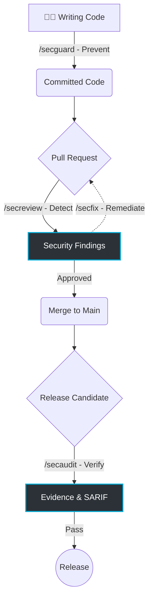

# SecGuardian

> **AI-Native Security Workflow for the Entire Software Development Lifecycle**

[](https://github.com/secguardian/secguardian)
[](https://github.com/secguardian/secguardian/blob/develop/CHANGELOG.md)
[](https://go.dev)
[](https://github.com/secguardian/secguardian/blob/develop/knowledge/language-index.md)
[](https://github.com/secguardian/secguardian/blob/develop/knowledge/language-index.md)
[](https://opensource.org/licenses/Apache-2.0)

SecGuardian is an enterprise-grade, AI-powered application security framework. It integrates LLM reasoning with strict security engineering practices to help teams build, review, fix, and release secure software through **four automated security gates**.

By moving beyond raw AI code generation and introducing **Rule Packs**, SecGuardian translates standards like OWASP ASVS, NIST SSDF, and PCI DSS into machine-executable audit rules that run seamlessly in your CLI and CI/CD pipelines.

---

## 🚀 Quick Start

```bash
# One-command deployment for supported CLI platforms
bash scripts/dev-deploy.sh

# Or install for a specific environment:
bash scripts/deploy.sh cc     # Claude Code
bash scripts/deploy.sh nga    # OpenCode
bash scripts/deploy.sh cac    # Gemini CLI

```

---

## 🛡️ The Secure SDLC Pipeline

SecGuardian embeds security directly into the developer workflow. Rather than a single monolithic scan, it provides contextual tools for every stage of development.



### The Four Security Gates

| Command | Stage | Primary User | Outcome |
| --- | --- | --- | --- |
| **`/secguard`** | Implementation | Developers | Continuous coding guidance to prevent vulnerabilities before they are committed. |
| **`/secreview`** | Pull Request | Reviewers | Context-aware AI code review that reasons about business logic and exploitability. |
| **`/secfix`** | Remediation | Developers | Auto-generates deterministic, ready-to-apply patches for detected vulnerabilities. |
| **`/secaudit`** | Release | Security/Ops | Evaluates the application against enterprise redlines (Rule Packs) prior to release. |

---

## 🧠 Enterprise Governance as Code (Rule Packs)

Raw AI reasoning is powerful, but enterprise security requires consistency, traceability, and compliance. SecGuardian achieves this through **Rule Packs**.

A Rule Pack is a machine-executable knowledge asset that maps published standards to strict audit rules, evidence requirements, and pass/fail criteria. Teams can version, review, and customize these rules independently of the underlying AI model.

**Current Capabilities:**

* 100% coverage for CWE Top 25 and OWASP Top 10.
* Deep analysis strategies including Taint Analysis, Data Flow, Attack Surface, and State Machine Analysis.
* **60 detectors across 7 namespaces:** Memory, Concurrency, System, Crypto, Web, and Error handling.

**Upcoming Rule Packs:** `OWASP ASVS`, `NIST SSDF`, `CIS Benchmarks`, `PCI DSS`.

---

## 💻 Developer Experience

SecGuardian is designed to be completely frictionless for the engineers writing the code.

### Automated Remediation in Minutes

Reduce a 30-minute vulnerability triage cycle to two minutes:

```bash
# 1. Detect vulnerabilities in your current diff
$ /secreview ./src cpp git diff

# 2. Generate ready-to-apply patches
$ /secfix findings/web-sql-injection/

# 3. Developer reviews the patch (git diff) and applies it, then verifies:
$ /secreview ./src cpp git diff

```

*Note: SecGuardian never merges code automatically. The developer retains final decision-making authority.*

### Comprehensive CI/CD Integration

Drop SecGuardian into your existing pipelines to generate management dashboards, SARIF outputs, and audit-ready evidence for every release.

```yaml
# .github/workflows/security.yml
- uses: secguardian/secguardian-action@v1
  with:
    mode: secaudit
    skill: taint-analysis
    path: src/

```

*Fully supports GitHub Security Code Scanning, GitLab SAST, and Azure DevOps.*

---

## 📊 Outputs & Artifacts

SecGuardian generates actionable outputs tailored to specific stakeholders:

* **Developers:** Diff-ready remediation patches.
* **Security Teams:** Markdown-based executive summaries and per-detector findings.
* **Release Managers:** `status.json` CI gate status and `delta.json` trend tracking.
* **Pipelines:** Industry-standard `results.sarif` outputs.

---

## 🤝 Contributing & Vision

Our vision is to evolve from an **AI Security Scanner** to a comprehensive **AI Security Governance Platform**—making enterprise-grade application security accessible to every development team without slowing them down.

We welcome contributions! Please see our [Contributing Guidelines](https://www.google.com/search?q=CONTRIBUTING.md) to get started.

## 📄 License

This project is licensed under the [Apache License 2.0](https://www.google.com/search?q=LICENSE).
*(Update this to your actual OSS license if different).*

```

<FollowUp label="Which open-source license are you planning to use?" query="I am planning to use the Apache 2.0 license. What other documents (like CONTRIBUTING.md) should I add to make this look like a top-tier open source project?"/>

```