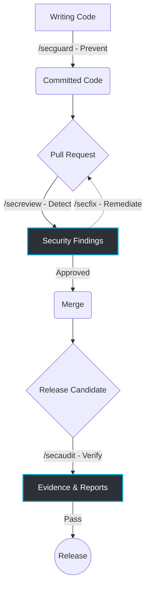

# SecGuardian

> **AI-Native Security Workflow for the Entire Software Development Lifecycle**

[](https://github.com/secguardian/secguardian)
[](https://github.com/secguardian/secguardian/blob/develop/CHANGELOG.md)
[](https://go.dev)
[](https://github.com/secguardian/secguardian/blob/develop/knowledge/language-index.md)
[](https://github.com/secguardian/secguardian/blob/develop/knowledge/language-index.md)

SecGuardian is an enterprise-grade AI application security framework. It integrates AI reasoning with security engineering practices to help teams build, review, fix, and release secure software through **four automated security gates**.

By moving beyond raw AI code generation and introducing **Rule Packs**, SecGuardian translates standards like OWASP ASVS, NIST SSDF, and PCI DSS into machine-executable audit rules that run in your CLI and CI/CD pipelines.

---

## Quick Start

Choose your scenario:

### I use Claude Code

```bash
# One-time setup
bash scripts/deploy.sh cc

# Then in any Claude Code session:
/secguard ./src           # Secure coding guidance
/secreview                # PR security review (auto git diff)
/secfix                   # Auto-remediation from latest scan
/secaudit                 # Full audit (auto-detect language)
```

### I use OpenCode

```bash
bash scripts/deploy.sh nga

# Same commands:
/secguard ./src
/secreview
/secfix
/secaudit
```

### I use Gemini CLI

```bash
bash scripts/deploy.sh cac

# Same commands:
/secguard ./src
/secreview
/secfix
/secaudit
```

### I want to try it from source

```bash
git clone https://github.com/DannyAn/SecGuardian.git
cd SecGuardian
bash scripts/dev-deploy.sh

# Run against the built-in vulnerable examples:
/secguard examples/cpp-vuln-demo/src cpp
/secreview examples/python-vuln-demo/src python
/secaudit --rulepack secguardian examples/java-vuln-demo/src java
```

### Standalone indexer (Go developers)

```bash
cd internal && go build -o secguardian-index .
./secguardian-index --path ./src --output index.json
```

---

## The Secure SDLC Pipeline

 The Software Development Lifecycle (SDLC) describes the stages of building software — from writing code and reviewing changes to shipping a release. SecGuardian embeds security into each of these stages. Rather than a single monolithic scan, it provides contextual tools purpose-built for each phase.



### The Four Security Gates

| Command | Stage | Primary User | Outcome |
| --- | --- | --- | --- |
| **`/secguard`** | Implementation | Developers | Continuous secure coding guidance during development. |
| **`/secreview`** | Pull Request | Reviewers | Context-aware AI code review using business logic and exploitability analysis. |
| **`/secfix`** | Remediation | Developers | Auto-generates deterministic, ready-to-apply patches from findings. |
| **`/secaudit`** | Release | Security / Ops | Evaluates the application against enterprise Rule Packs before release. |

These four commands represent different stages of Secure SDLC, not different levels of scanning.

---

## Enterprise Governance as Code (Rule Packs)

Raw AI reasoning is powerful, but enterprise security requires consistency, traceability, and compliance. SecGuardian achieves this through **Rule Packs** — machine-executable knowledge assets that map published standards to audit rules, evidence requirements, and pass/fail criteria.

```
audit-framework/
├── rulepacks/             # Pluggable rule pack definitions
│   ├── secguardian/       # Built-in default (17 audit domains)
│   │   ├── pack.json      # Manifest + standard mappings
│   │   └── rules/         # 17 audit rules
│   ├── company-redline/   # Future: enterprise security baseline
│   └── owasp-asvs/        # Future: OWASP ASVS compliance
├── engine/                # Execution engine specification
├── templates/             # Report template definitions
└── reporters/             # Output format extensions
```

Teams can version, review, and customize Rule Packs independently of the AI model. The AI engine can be upgraded without touching the security knowledge, and vice versa — Rule Packs outlast the AI model.

### Current coverage

CWE Top 25: **100%** coverage. OWASP Top 10: **100%** coverage.

60 detectors across 7 security namespaces, supporting C/C++/Java/Python/Go/JavaScript:

| Namespace | Count | Coverage |
| --- | --- | --- |
| memory | 13 | Buffer overflow, UAF, double-free, null dereference |
| concurrency | 4 | Race conditions, deadlocks |
| system | 7 | Command injection, path traversal |
| crypto | 9 | Weak algorithms, hardcoded keys |
| web | 21 | XSS, SQLi, SSRF, CSRF, prototype pollution |
| resource | 6 | File/socket/resource leaks, lock misuse |
| error | 6 | Stack trace leakage, sensitive data in logs |

Analysis strategies include Taint Analysis, Data Flow Analysis, Attack Surface Analysis, Trust Boundary Analysis, and State Machine Analysis. These are tools, not the product — the long-term value lies in the Rule Packs that define what to analyze and the workflow that acts on the results.

### Standards in development

- OWASP ASVS (Application Security Verification Standard)
- NIST SSDF (Secure Software Development Framework)
- CIS Benchmarks
- PCI DSS
- Enterprise Security Baselines

---

## Developer Experience

SecGuardian is designed for zero friction in daily use. All commands work with zero arguments — they auto-detect the target language, current directory, and most recent scan context.

### Automated Remediation

Reduce a 30-minute vulnerability triage cycle to roughly two minutes:

```bash
# 1. Detect vulnerabilities in your current PR
/secreview

# 2. Generate ready-to-apply patches
/secfix findings/web-sql-injection/

# 3. Review the patch and apply
git diff
git apply findings/web-sql-injection/*.patch

# 4. Re-run to verify
/secreview
```

SecGuardian never merges code automatically. The developer retains final decision-making authority on every patch.

### CI/CD Integration

```yaml
# .github/workflows/security.yml
- uses: secguardian/secguardian-action@v1
  with:
    mode: secaudit
    skill: taint-analysis
    path: src/
```

Also supports GitLab SAST (`artifacts:reports:sast`) and Azure DevOps SARIF upload.

### Scan Output

```
.codeagent/<extension>/scans/<scan-id>/
├── human/executive-summary.md     # Executive dashboard
├── findings/                      # Per-detector finding files
├── ai/remediation-pack.json       # AI-consumable remediation pack
├── report.md                      # Human-readable report
├── dashboard.html                 # Management dashboard
├── results.sarif                  # SARIF 2.1.0 (CI/CD input)
├── summary.json                   # Summary statistics
├── manifest.json                  # Scan metadata + finding index
├── status.json                    # CI gate status
└── delta.json                     # Delta vs previous scan
```

---

## Vision

Our vision is to make enterprise-grade application security accessible to every development team. Security engineers remain at the center of the process — they work with better tooling, not fewer people.

We are building toward that vision in three phases:

> **AI Security Scanner** → **AI Security Workflow** → **AI Security Governance Platform**

The Audit Framework and Rule Packs we are building today lay the foundation for that third phase: a governance platform where organizations define their security policies as executable rules, run them across every stage of development, and produce audit-ready evidence for every release.

---

## License

Proprietary. All rights reserved.
