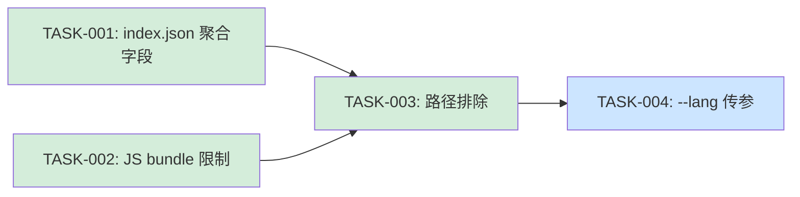

# FEATURE-005: Indexer Robustness — Plan

> **Goal**: 消除索引器对非预期输入（跨语言文件、minified bundle）的卡死风险，使含前端构建产物的后端项目也能正常扫码。
>
> **基于**：Spec 的 REQ-001 ~ REQ-006

## 架构

```
改动范围（4 次 commit，4 个独立可验证的 Task）:

TASK-001  ── internal/context/context.go +2 字段
            internal/main.go +6 行序列化逻辑
            └── 验证: index.json 有 file_count/function_count/call_edge_count/primary_language

TASK-002  ── internal/parser/parser_javascript.go +15 行守卫
            └── 验证: 对 chunk-libs.dc48dc82.js 返回空 result (跳过)

TASK-003  ── internal/main.go +5 个 skipDir 条目
            └── 验证: target/ 目录下的 .java 文件不被收集

TASK-004  ── commands/secguard.md Step 2 索引器调用加入 --lang <language>
            └── 验证: grep 确认 1 处修改 + dev-deploy.sh 后 /secguard ./src java 传参正确
```

## 文件改动清单

| 文件 | 改动类型 | 改动量 | 涉及 Task |
|------|---------|--------|----------|
| `internal/context/context.go` | 新增字段 | +2 行 | TASK-001 |
| `internal/main.go` | 序列化 + 路径排除 | +11 行 | TASK-001, TASK-003 |
| `internal/parser/parser_javascript.go` | 守卫逻辑 | +15 行 | TASK-002 |
| `commands/secguard.md` | 指令文本 | 1 行（line 171 变更多行） | TASK-004 |
| `scripts/package.sh` | 补充 | TBD（由 FEATURE-003 处理） | — |

## 架构影响分析

### 兼容性

- **index.json 新增字段为兼容性扩展**：`file_count` / `function_count` / `call_edge_count` / `primary_language` 是顶层新增键，不对现有 renderer 和 AI 消费逻辑产生破坏。旧的 `data.symbols.functions` → `len()` 路径仍然有效。
- **JS 跳过是降级行为**：minified bundle 跳过不解析后，index.json 中不包含该文件的符号信息。不影响 Java/Python/Go 等目标语言的索引。
- **skipDir 扩展是黑名单增强**：不改变任何现有项目的扫描行为（因为这些目录在之前的扫描中本来也没贡献有用符号）。

### 测试策略

| Task | Go Test | 手动验证 | 回归 |
|------|---------|---------|------|
| TASK-001 | 无（序列化逻辑在 main.go，无 test file） | `go run . --path examples/java-vuln-demo --output /tmp/test.json && cat /tmp/test.json \| python3 -c ...` | 不影响现有解析逻辑 |
| TASK-002 | 无（parser_javascript.go 无 test file） | 对已知 large bundle 确认跳过 | 不影响正常 JS 文件解析 |
| TASK-003 | 无（collectFiles 在 main.go） | `go run . --path . --output /tmp/test.json 2>&1` 确认 target/ 过滤 | 不影响现有文件收集 |
| TASK-004 | N/A（Markdown 指令） | `dev-deploy.sh` 后扫描 | 确认扫描正常完成 |

## 执行顺序与依赖



> TASK-001 和 TASK-002 无相互依赖，可并行。TASK-003 依赖二者的完成。TASK-004 是流程指令调整，依赖前面的代码改动验证通过。

## Task 列表

| 编号 | 描述 | 依赖 | 预计改动量 | 验证命令 |
|------|------|------|-----------|---------|
| TASK-001 | context.go + main.go: index.json 增加 file_count/function_count/call_edge_count/primary_language | 无 | +8 行 | `go run . --path examples/java-vuln-demo --output /tmp/index.json && python3 -c "import json; d=json.load(open('/tmp/index.json')); print(d['file_count'], d['function_count'], d['call_edge_count'], d['primary_language'])"` |
| TASK-002 | parser_javascript.go: 增加文件大小 + 行长双阈值守卫 | 无 | +15 行 | `cp examples/java-vuln-demo/src/main/resources/static/js/chunk-libs.js /tmp/test_bundle.js && go test ./internal/parser/ -run TestJS ...` |
| TASK-003 | main.go: skipDir 增加 target/build/static/public/resources | TASK-001, TASK-002 | +5 行 | `go run . --path . --output /tmp/check.json 2>&1 \| grep -v "Skipped"` |
| TASK-004 | commands/secguard.md: Step 2 索引器调用加入 `--lang <language>` | TASK-003 | 1 处指令修改 | `grep '\-\-lang <language>' commands/secguard.md` |

## 验证

每个 Task 独立验证（见上表）。全部完成后 E2E 验证：

```bash
# 1. Go 编译 + 冒烟
go build ./...
go run . --health

# 2. 构建部署
bash scripts/package.sh
bash scripts/self-check.sh

# 3. 对 Java 项目扫描（含前端 bundle）
go run . --path /path/to/java-project --lang java --output /tmp/e2e.json
# 确认 index.json 有 file_count 等字段，无 JS 文件

# 4. 验证 index.json 结构
python3 -c "
import json
d = json.load(open('/tmp/e2e.json'))
assert 'file_count' in d, 'Missing file_count'
assert 'primary_language' in d, 'Missing primary_language'
print(f'✅ file_count={d[\"file_count\"]}, function_count={d[\"function_count\"]}, primary_language={d[\"primary_language\"]}')
"
```
